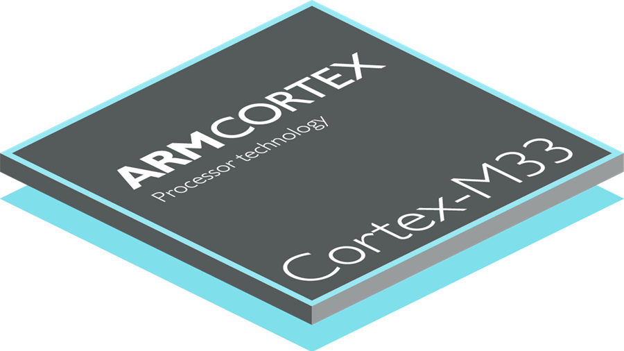

# Build Your Own RealTime OS (RTOS) from the Ground Up on ARM

This repository contains my individual work for the **[Build Your Own RealTime OS (RTOS) From Ground Up™ on ARM 1](https://www.udemy.com/course/rtos-building-from-ground-up-on-arm-processors/)** Udemy class created and taught by Israel Gbati.

## Overview

The objective of this online class is the build Your Own RealTime Operating Systems from first principles on a STM32 discovery board. From the course description:

> This course teaches you how to build a Real-Time Operating Systems through intensive practice and theory. It starts by getting you excited through an introduction to the internals of a Real-Time Kernel on ARM Processors, which you shall implement yourself in code.Then we move on to learn all there  is about Real-Time Operating Systems, their various parts, how they work and then we finally build our own Real-Time Operating System exploring different scheduling algorithms and Inter-Thread communication tools. 

> At the end of this course you should be able to build your own Real-Time Operating System from scratch, give your own lecture on Real-Time Operating Systems, be able to build a Round-Robin Scheduler, be able to build a Periodic Scheduler, be able to calculate the CPU utilization of your RTOS, be able to build an OS Kernel etc. Please see the course curriculum section to find out all the amazing content awaiting you.

Concepts and skills learned during the course include

* Build a Real-Time Operating System from Scratch
* Build Round-Robin Schedulers
* Build Cooperative Schedulers
* Build Periodic Schedulers
* Build First Come First Served Scheduler
* Build Rate Monotonic Schedulers
* Build a board support package from scratch
* Calculate the CPU Utilization of an RTOS
* Write Bare-Metal Embedded-C Code
* Write Assembly code
* Understand the OS Support Features of the Cortex-M Architecture
* Understand the Internals of an RTOS Kernel
* Be Implement to implement and explain popular scheduling algorithms
* Be able to explain the Cortex-M Architecture
* Be able to give a lecture on Real-Time

## This Repository

Content contained within this repository is my own work produced as a result of completing this course. Work being completed projects, deliverables, and notes. Lectures and course material are not included however.
